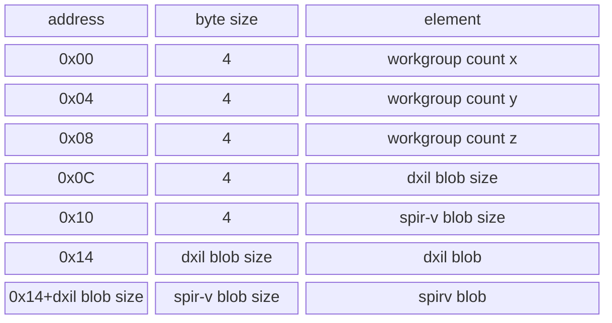

# RHI
Rendering Hardware Interface for D3D12 and Vulkan.

## Table of Contents
- [Building](#building)
- [Usage](#usage)
    - [Graphics Device](#graphics-device)
    - [Buffers, Images and Samplers](#buffers-images-and-samplers)
    - [Shader Blobs and Pipelines](#shader-blobs-and-pipelines)
    - [Command Pools and Command Lists](#command-pools-and-command-lists)
    - [Fences](#fences)
    - [Swapchain](#swapchain)
- [Legal](#legal)

## Building
1. Clone the repository: `git clone https://github.com/rtryan98/rhi.git --recurse-submodules --shallow-submodules`.
2. Call CMake inside the cloned repository: `cmake -B build -G "Visual Studio 17 2022"`.
    - Optionally disable building either the D3D12 backend or the Vulkan backend by setting the respective CMake option `RHI_GRAPHICS_API_D3D12` or `RHI_GRAPHICS_API_VULKAN` to `OFF`.
    However, at least one graphics backend must be built.
    - Optionally disable usage of WinPixEventRuntime by setting the CMake option `RHI_USE_PIX` off.
    This option has no effect if the D3D12 backend is not being built.
    - Optionally disable building tests by setting the CMake option `RHI_BUILD_TESTS` off.

## Usage
The RHI is designed to be as easy as possible to use if you're familiar with either Vulkan or D3D12.
To begin using the RHI, you first need to link to it.
```cmake
add_subdirectory(<path/to/rhi>)
target_link_libraries(<your_target> PUBLIC rhi)
```
Once linked you can start using the RHI in your code.

### Graphics Device
To get started with using the RHI, the first thing that needs to be created is the `Graphics_Device`.
Validation layers for both D3D12 and Vulkan can be enabled and the instance can be created with internal locks as well.
```cpp
#include <rhi/graphics_device.hpp>
// ...
rhi::Graphics_API_Create_Info device_create_info = {
    .graphics_api = rhi::Graphics_API::D3D12,
    .enable_validation = true,
    .enable_gpu_validation = false,
    .enable_locking = false
};
auto graphics_device = rhi::Graphics_Device::create(device_create_info);
```
If the `Graphics_Device` instance was created with `enable_locking` set to `true`, then all resource creation and destruction member functions as well as `Command_List` submission will be synchronized properly.
This does not solve any lifetime issues that may arise however, so destroying a resource that may be read is invalid.
When the `Graphics_Device` is destroyed all resources created from it will be invalidated and released with the exception of `Swapchain`s and `Command_Pool`s and their corresponding `Command_List`s.

### Buffers, Images and Samplers
Creating resources is simplified compared to the D3D12 and Vulkan counterpart.
`Buffer`s, `Image`s and `Sampler`s are created using the `Graphics_Device`.
For example
```cpp
rhi::Buffer_Create_Info buffer_create_info = {
    .size = 1ull << 16,
    .heap = Memory_Heap_Type::GPU
};
auto buffer = graphics_device->create_buffer(buffer_create_info);
```
Once the resource (excluding samplers) is created a corresponding default view is also created.
The default view is across the entire resource if applicable.
One exception is UAVs of images with multiple mip levels, in which case the first mip level is only taken.
Further exceptions are Render Target Views and Depth Stencil Views of Images where only the first array layer and first mip level is used.
Both `Buffer_View`s and `Image_View`s consist of a `bindless_index` which can be used in a shader to access the resource.
Further views can be created using the `Graphics_Device`.
Additional views will have their own `bindless_index`.
Views are destroyed and invalidated when their parent is destroyed.

Samplers do not have views.
However, they directly contain their corresponding `bindless_index`.

### Shader Blobs and Pipelines
To make use of `Pipeline`s, we first need `Shader_Blob`s.
Those are created using the `Graphics_Device`.
```cpp
rhi::Shader_Blob_Create_Info shader_blob_create_info = {
    .data = compute_shader_data,
    .data_size = compute_shader_data_size,
    .groups_x = 512, // Optional to keep track of the group size for compute/task/mesh shaders
    .groups_y = 1,
    .groups_z = 1
};
auto shader_blob = graphics_device->create_shader_blob(shader_blob_create_info);

rhi::Compute_Pipeline_Create_Info pipeline_create_info = {
    .cs = shader_blob
};
auto compute_pipeline = graphics_device->create_pipeline(pipeline_create_info);
```
It is up to the user to pass the correct shader data for the respective API.
This means DXIL for D3D12 and SPIR-V for Vulkan.
The shader blob may be created with an empty `Shader_Blob_Create_Info` to be filled later, for example by deserialization.

Additionally, a DXC wrapper exists which compiles the shaders to both DXIL and SPIR-V and reflects the workgroup data.
They are serialized into the following memory format (little endian):

The format can easily be used with the function `Graphics_Device::recreate_shader_blob_deserialize_memory`.
If this function is used the correct blob will automatically be selected.
Shader blob recreating requires the user to correctly synchronize access as no locking is done even when the `Graphics_Device` was created with `enable_locking = true`.
This means creating or recreating a pipeline using this shader whilst the shader is being recreated is a data race.

### Command Pools and Command Lists
`Command_Pool`s are required to create `Command_List`s.
A `Command_Pool` is created using the `Graphics_Device`.
`Command_Pool`s are thread-affine and in a multi-threading scenario multiple instances should be created.
They are also not frame-aware so multiple instances need to be created per frame-in-flight.
The `Command_List` acquired via `Command_Pool::acquire_command_list` is transient and must not be kept across multiple frames.

`Command_List`s offer most of the common D3D12 and Vulkan commands.
Some additional API-specific commands are available and are postfixed with their API.
Those commands must not be called when the API does not match.

### Fences
`Fence`s are a direct mapping of D3D12s fences and Vulkans timeline semaphores.
A `Fence` is created using the `Graphics_Device`.
They can be waited on and their state can be queried against a value.

### Swapchain
Next up is creating a `Swapchain` to render to.
This is done via a `Graphics_Device`.
```cpp
#include <rhi/swapchain.hpp>
// ...
rhi::Swapchain_Win32_Create_Info swapchain_create_info = {
    .hwnd = /* your HWND */,
    .preferred_format = Image_Format::R8G8B8A8_UNORM,
    .image_count = 3,
    .present_mode = Present_Mode::Immediate
};
auto swapchain = graphics_device->create_swapchain(swapchain_create_info);
```
Once the `Swapchain` is created we get access to the actually used `Image_Format` which may deviate from the `preferred_format` we have provided, for example `Image_Format::R8G8B8A8_UNORM` may become `Image_Format::B8G8R8A8_UNORM` when using Vulkan.
This query is useful for creating graphics pipelines that directly render onto the swapchain.

In your render loop you'll have to use the following functions: `Swapchain::query_resize`, `Swapchain::acquire_next_image`, `Swapchain::get_current_image_view` and `Swapchain::present`.
The `Image_View` pointers are stable but not synchronized even when the `Graphics_Device` was created with `.enable_locking = true`.
This means that whilst reading them is safe, the user must ensure that those `Image_View`s are not used whilst the swapchain is being resized.
A typical render loop may look like this:
```cpp
while (do_render)
{
    // Handle inputs etc.

    // Assuming frame is handled by user
    auto& frame = frames[current_frame_index];
    frame.fence->wait_for_value(frame.fence_value);
    auto swapchain_resize_info = swapchain->query_resize();
    if (swapchain_resize_info.is_size_changed)
    {
        /* Resize your window-size dependent resources.
         * There is no need to explicitly synchronize the GPU.
         * If a resize happens all queues are synchronized with the CPU.
         */
    }
    swapchain->acquire_next_image();
    frame.command_pool->reset();
    auto cmd = frame.command_pool->acquire_command_list();

    // Render things onto swapchain...
    auto swapchain_view = swapchain->get_current_image_view();

    Submit_Fence_Info signal_info = {
        .fence = frame.fence,
        .value = ++frame.fence_value
    };
    /* Only one submit, we want to wait for the image to be available and we want to present after submitting.
     * `wait_swapchain` is a pointer to a swapchain that is being used in the current submit.
     * This is used for synchronizing swapchain image acquisition with command list execution.
     * `present_swapchain` is a pointer to a swapchain that will be used for presentation after the submit.
     * This is used for synchronizing end of command list execution with swapchain image presentation.
     */
    rhi::Submit_Info submit_info = {
        .queue_type = Queue_Type::Graphics,
        .wait_swapchain = swapchain.get(),
        .present_swapchain = swapchain.get(),
        .command_lists = std::span<Command_List*>{ cmd, 1 },
        .signal_infos = std::span<Submit_Fence_Info>{ &signal_info, 1 }
    };
    device->submit(submit_info);
    swapchain->present();
}
```

## Legal
This project is licensed under the MIT license.
However, it makes of the DirectX 12 Agility SDK, DirectX Shader Compiler and WinPixEventRuntime, all of which have their own licenses.
Building RHI automatically downloads those libraries and as such by building the RHI you must also agree to those licenses.
- [DirectX 12 Agility SDK License](https://www.nuget.org/packages/Microsoft.Direct3D.D3D12/1.613.0/License)
- [WinPixEventRuntime License](https://www.nuget.org/packages/WinPixEventRuntime/1.0.231030001/License)
- [DirectX Shader Compiler](https://github.com/microsoft/DirectXShaderCompiler/blob/main/LICENSE.TXT)
